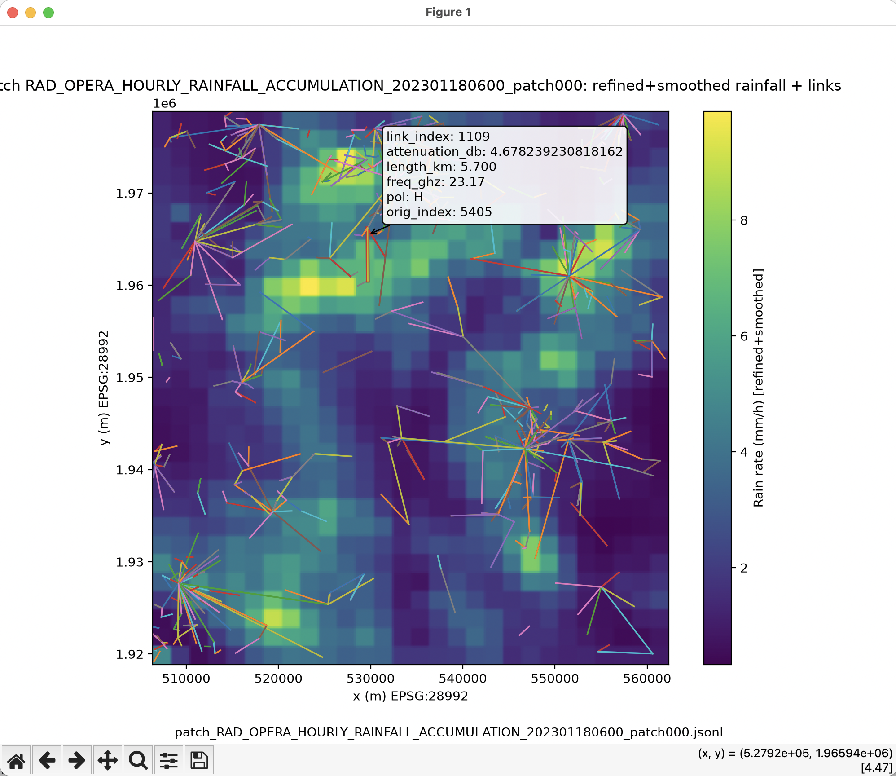

# Patch Viewers

This folder contains small visual inspection helpers for patch inputs and generated attenuation files. They are useful for debugging or manually checking individual patches, but they are not part of the maintained batch pipeline in `../../HundredPatches/pipeline/`.

## Scripts

- `view_estimator_input.py`: plots a ground-truth rainfall array from `gt_*.npz` and overlays the links from the matching `est_input_*.json` in the same patch-local coordinate frame. Link colors represent attenuation.
- `view_patch.py`: interactive viewer for a selected patch. It loads patch/link metadata, shows the refined and smoothed rainfall field, overlays links, and lets you click near a link to inspect its attenuation, length, frequency, and polarization.

## Usage

The examples below run from `Compute-Link-Attenuations/`. The interactive viewer
also runs directly from this folder with `python3 view_patch.py`; it locates the
local `cml_attenuation` package relative to the script. Relative input paths are
resolved from your current working directory.

For an already-generated estimator input and ground-truth file:

```bash
python Misc/patch_viewers/view_estimator_input.py \
  --est HundredPatches/est_dir/est_input_<patch_id>.json \
  --gt HundredPatches/gt_dir/gt_<patch_id>.npz
```

For the interactive patch viewer:

```bash
python Misc/patch_viewers/view_patch.py
```

or pass a config file:

```bash
python Misc/patch_viewers/view_patch.py --config /path/to/view_patch_config.json
```

## Browsing the 100 Patch Set

`view_patch.py` can browse the 100 generated patch JSONL files with Previous and
Next buttons. Run the viewer without `--config`:

```bash
python Misc/patch_viewers/view_patch.py
```

When the directory picker opens, choose:

```text
Compute-Link-Attenuations/HundredPatches/patch_overview_generation/patch_jsonl_files
```

If you are running `python3 view_patch.py` from this `patch_viewers` directory,
enter this relative path instead:

```text
../../HundredPatches/patch_overview_generation/patch_jsonl_files
```

Then choose a starting `patch_*.jsonl` file. If the viewer asks for the patch
list JSONL path, use:

```text
Patch-Generator/Benchmark-Patches/benchmark-500-files-758-patches.local.jan2023.jsonl
```

From this `patch_viewers` directory, the same patch-list path is:

```text
../../../Patch-Generator/Benchmark-Patches/benchmark-500-files-758-patches.local.jan2023.jsonl
```

The viewer loads the selected patch's rainfall field, overlays the links, and
lets you click links to inspect their attenuation and metadata. It needs access
to the original rainfall HDF5 files referenced by the benchmark patch list.

The rainfall shown by `view_patch.py` comes from those original HDF5 events, but
is cropped to the selected patch and then refined and smoothed for the link
calculation. The original event files are stored under:

```text
Patch-Generator/backend/data/raw/
```

To inspect an unprocessed event, open the HDF5 file named by the patch's
`source_file` field with an HDF5 viewer (for example HDFView) or a Python
session using `h5py`. The rainfall dataset is normally at
`/dataset1/data1/data` (the loader also checks a few fallback dataset paths).

There are also pre-rendered report artifacts for the 100 patch set:

- Overview map:
  `Compute-Link-Attenuations/HundredPatches/pipeline/report/images/patch_overview/hundredpatches_europe_overview.svg`
- Per-patch comparison/error maps:
  `Compute-Link-Attenuations/HundredPatches/pipeline/report/images/patch_error_maps/`

## Interactive Viewer Preview

The background shows the refined and smoothed rain rate, with links overlaid in
RD New (`EPSG:28992`) coordinates. Link colors are only for visual distinction
and do not encode values. Clicking near a link highlights it and displays its
index, simulated attenuation, length, frequency, polarization, and original
source index.



## Status

Treat these as optional manual tools. They are intended for quick inspection and debugging rather than for regenerating the benchmark, solving patches, or rendering the report artifacts.
