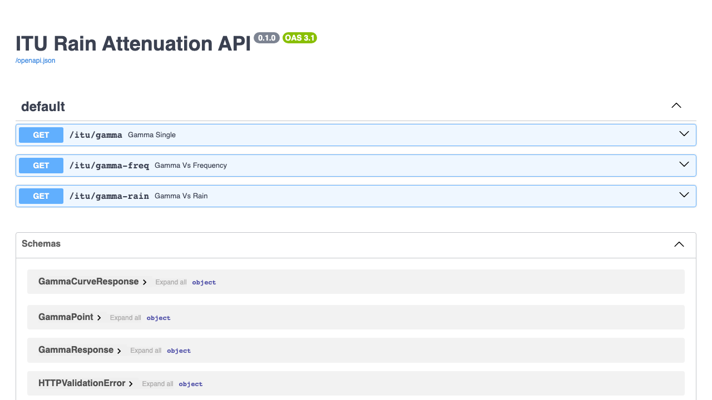

# ITU-Calculator

Small calculator/API for ITU-R P.838-3 rain-attenuation coefficients. It is useful for checking the frequency- and polarization-dependent coefficients used by the attenuation forward model in `Compute-Link-Attenuations/`.

The maintained runnable code is the FastAPI backend in `Python-React/backend/`.

## What It Computes

The API evaluates the ITU-R-style specific attenuation relation

```text
gamma_R = k(f, pol) * R^alpha(f, pol)
```

where `f` is carrier frequency in GHz, `R` is rain rate in mm/h, `pol` is polarization, and `gamma_R` is specific attenuation in dB/km.

Available endpoints include:

- `/itu/gamma`: one coefficient/evaluation point.
- `/itu/gamma-freq`: attenuation curve as frequency varies at fixed rain rate.
- `/itu/gamma-rain`: attenuation curve as rain rate varies at fixed frequency.

## Setup

From the repository root:

```bash
cd ITU-Calculator/Python-React/backend
python3 -m venv .venv
source .venv/bin/activate
pip install fastapi 'uvicorn[standard]' pydantic
```

## Run

```bash
python main.py
```

or equivalently:

```bash
uvicorn api:app --host 127.0.0.1 --port 8000 --reload
```

Then open the auto-generated API docs:

```text
http://127.0.0.1:8000/docs
```

Example query:

```text
http://127.0.0.1:8000/itu/gamma?f_ghz=25&R_mm_per_h=10&pol=horizontal
```

Expected output is JSON containing `k`, `alpha`, and `gamma` for the requested frequency, rain rate, and polarization.

## Notes

`Python-React/frontend/` currently contains frontend source snippets but not a complete committed React package setup. Treat the backend API as the reliable runnable interface unless a frontend package is added later.

## Browser Preview

After following the backend instructions above, open `/docs` to inspect and try the API endpoints in the browser:


