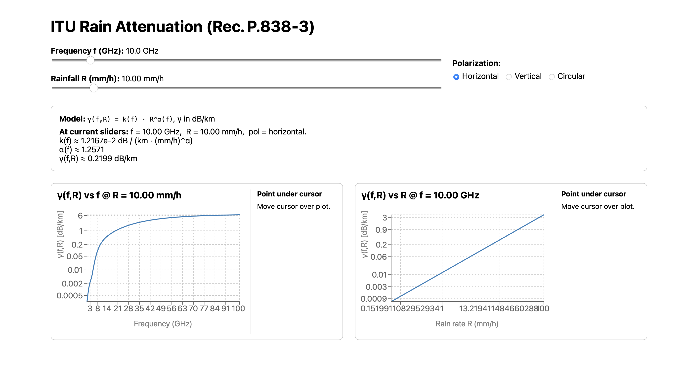

# ITU-Calculator

Small calculator/API for ITU-R P.838-3 rain-attenuation coefficients. It is useful for checking the frequency- and polarization-dependent coefficients used by the attenuation forward model in `Compute-Link-Attenuations/`.

The maintained runnable code has two parts: the FastAPI backend in `Python-React/backend/` and a small React/Vite UI in `Python-React/frontend/`.

## What It Computes

The API evaluates the ITU-R-style specific attenuation relation

```text
gamma_R = k(f, pol) * R^alpha(f, pol)
```

where `f` is carrier frequency in GHz, `R` is rain rate in mm/h, `pol` is polarization, and `gamma_R` is specific attenuation in dB/km.

Available endpoints include:

- `/itu/gamma`: one coefficient/evaluation point.
- `/itu/gamma-freq`: attenuation curve as frequency varies at fixed rain rate.
- `/itu/gamma-rain`: attenuation curve as rain rate varies at fixed frequency.

## Backend Setup

From the repository root:

```bash
cd ITU-Calculator/Python-React/backend
python3 -m venv .venv
source .venv/bin/activate
pip install fastapi 'uvicorn[standard]' pydantic
```

## Run The Backend

```bash
python3 main.py
```

or equivalently:

```bash
uvicorn api:app --host 127.0.0.1 --port 8000 --reload
```

Then open the auto-generated API docs:

```text
http://127.0.0.1:8000/docs
```

Example query:

```text
http://127.0.0.1:8000/itu/gamma?f_ghz=25&R_mm_per_h=10&pol=horizontal
```

Expected output is JSON containing `k`, `alpha`, and `gamma` for the requested frequency, rain rate, and polarization.

## Run The UI

Keep the backend running at `http://127.0.0.1:8000`. In a second terminal, start the React/Vite frontend:

```bash
cd ITU-Calculator/Python-React/frontend
npm install
npm run dev
```

Then open:

```text
http://127.0.0.1:5173/
```

The UI uses the backend endpoints above to update the current `k`, `alpha`, and `gamma` values and to draw attenuation curves as frequency or rain rate changes. If the UI loads but the numbers or plots do not update, first check that the backend is still running on port `8000`.

## Browser Preview

After following the backend and frontend instructions above, open the UI in the browser:


