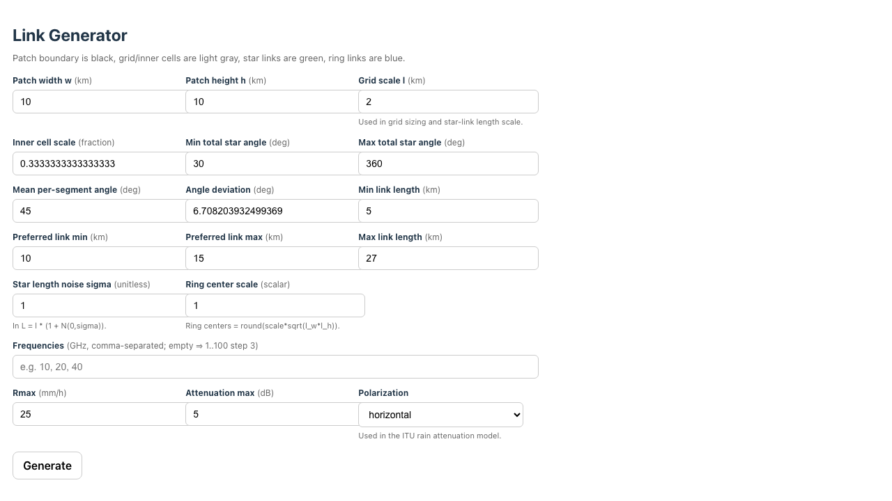

# Link-Generator

This folder contains tools for generating and inspecting synthetic microwave-link layouts. It is separate from the maintained 100-patch benchmark, which uses 4TU-derived link geometries under `Compute-Link-Attenuations/HundredPatches/`. Use it when you want to experiment with generated link networks, inspect their geometry, or check which frequencies are feasible for a proposed layout.

## Contents

- `backend/`: FastAPI backend that generates link geometries and assigns/checks frequencies using ITU-style attenuation limits.
- `frontend/`: React/Vite interface for visual inspection and parameter tweaking.
- `backend/requirements.txt`: Python dependencies for the backend.
- `backend/install-and-run-commands.txt`: older short command notes; the commands below are the maintained version.

## Setup And Run The Backend

From the repository root:

```bash
cd Link-Generator/backend
python3 -m venv .venv
source .venv/bin/activate
pip install -r requirements-lock.txt
uvicorn app:app --reload --port 8100
```

The main backend endpoint is:

```text
POST http://127.0.0.1:8100/generate_links
```

It accepts geometry parameters such as patch width/height, grid scale, candidate frequencies, rain-rate assumptions, attenuation limit, and optional random seed. The response contains generated points, links, link lengths, and assigned/allowed frequencies.

## How A Synthetic Network Is Generated

Each request generates one structured random link network inside a local
`w`-by-`h` rectangle measured in kilometres. The rectangle is not tied to a
longitude/latitude, map projection, or geographic offset. Its bounds are:

```text
lower-left:  (0, 0)
lower-right: (w, 0)
upper-left:  (0, h)
upper-right: (w, h)
```

The backend constructs the network as follows:

1. It divides the rectangle into a grid. The grid dimensions are derived from
   `w`, `h`, and the scale parameter `l`, and the cells are resized to fill the
   rectangle exactly.
2. It defines a smaller centered region inside each grid cell, controlled by
   `inner_cell_frac`, and randomly places one center point within that region.
3. It generates several star links from each center. Their orientations,
   angular spacing, and lengths are sampled randomly subject to the configured
   angle and length constraints. Both endpoints are kept inside the rectangle;
   the backend resamples or, as a fallback, clips a link to the boundary.
4. It randomly selects some center points and adds center-to-center links using
   a minimum spanning tree. These are reported as `ring` links, although they
   do not necessarily form a closed ring.
5. For every generated link, it selects the highest candidate frequency whose
   predicted rain attenuation does not exceed `attenuation_max` under the
   configured `Rmax` and polarization.

The backend accepts an optional `seed` for reproducible generation. Without a
seed, repeated requests with the same parameters normally produce different
networks. The current frontend does not expose or send the seed, so clicking
**Generate** repeatedly produces new layouts.

## Relationship To The 4TU Link Data

The generated layouts can serve as a synthetic alternative to the
Netherlands-derived 4TU link geometry in future experiments. They are not used
by the maintained 100-patch benchmark, which instead uses
`Links-4TU-NL/LIST-OF-LINKS.jsonl`.

Link-Generator is also not currently a drop-in replacement for that file. Its
response describes endpoints with local kilometre coordinates such as
`from_coord` and `to_coord`, whereas the benchmark-generation workflow expects
`XStart`, `YStart`, `XEnd`, and `YEnd` as WGS 84 longitude/latitude. The
response schema also differs from the 4TU JSONL schema. Using these synthetic
networks in that workflow therefore requires an adapter or a compatible export
mode that performs the necessary coordinate placement and field conversion.

## Setup And Run The Frontend

In another terminal:

```bash
cd Link-Generator/frontend
npm ci
npm run dev
```

The Vite dev server uses port `5175` according to `package.json`:

```text
http://127.0.0.1:5175
```

Keep the backend running on port `8100` while using the frontend.

## Expected Workflow

1. Start the backend.
2. Start the frontend.
3. Adjust link-generation parameters in the UI.
4. Inspect the generated network visually and/or use the backend JSON response for downstream experiments.

The generated layouts are exploratory. They are not required to reproduce the maintained 100-patch benchmark in `Compute-Link-Attenuations/HundredPatches/pipeline/`.

AI coding agents such as Codex can be useful for modifying the generation rules or adding export formats, but check generated geometries and parameter meanings manually before using them in experiments.

## Browser Preview

After following the backend and frontend instructions above, the browser app should open to a parameter form for generating synthetic link layouts:


