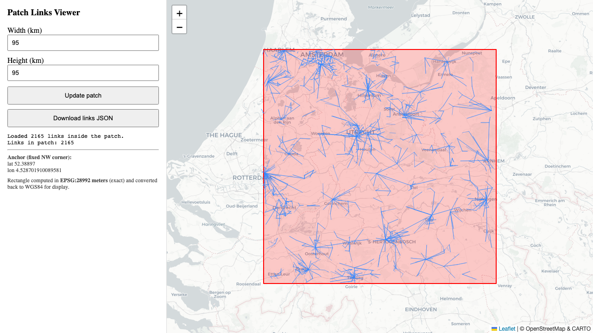

# Links-4TU-NL

Utilities and data helpers for the 4TU-NL commercial microwave-link data source. The link data provides realistic CML endpoints, lengths, and frequencies. In the maintained 100-patch workflow, these geometries are used as realistic link-network structure and are placed into selected radar-derived patch coordinate systems before simulated attenuations are generated.

## Contents

- `read-links.py`: converts raw 4TU/RAINLINK ZIP files into a deduplicated JSONL of unique directed links.
- `unique_links.jsonl`: deduplicated link records used by the helper tools.
- `LIST-OF-LINKS.jsonl`: link list used by the maintained attenuation pipeline.
- `patch-links-filter.py`: FastAPI backend for filtering links inside a rectangular patch footprint.
- `patch-map-frontend/`: React/Vite frontend for inspecting patch/link maps.
- `phase1_links_map.py`: script for creating static Folium HTML maps.
- `phase1_all_links*.html`: generated static map outputs.

## Python Setup

From the repository root:

```bash
cd Links-4TU-NL
python3 -m venv .venv
source .venv/bin/activate
pip install -r requirements.txt
```

## Convert Raw Link Data

If you have a raw ZIP from the 4TU/RAINLINK data source, convert it to a unique-link JSONL with:

```bash
python read-links.py /path/to/IDRawCMLdata.zip unique_links.jsonl
```

or:

```bash
python read-links.py /path/to/RawCMLdata.zip unique_links.jsonl
```

The output is one JSON object per unique directed link, keeping only:

```text
XStart, YStart, XEnd, YEnd, Frequency, PathLength
```

The endpoint coordinates use WGS 84 (`EPSG:4326`) in decimal degrees:

- `XStart` and `XEnd` are longitude, measured east/west from the Greenwich
  Prime Meridian.
- `YStart` and `YEnd` are latitude, measured north/south from the equator.
- `Start` and `End` identify the two physical endpoints of the microwave link;
  the coordinates are not relative to a radar patch or image grid.
- `Frequency` is in GHz.
- `PathLength` is in km.

Deduplication is always performed while `read-links.py` processes the input.
For each row, the four endpoint coordinates are rounded to six decimal places
by default and used to construct this ordered key:

```text
(YStart, XStart, YEnd, XEnd)
```

`Frequency` and `PathLength` are not part of the key. Therefore, if several
input rows have the same ordered endpoints after rounding, only the first row
encountered is written—even when later rows have different frequencies or path
lengths. The retained record consequently uses the first row's `Frequency` and
`PathLength`; the values are not averaged or otherwise combined. The
coordinate precision can be changed with the `--round` option.

Endpoint order matters. A record from site A to site B and a record from site B
to site A produce different keys:

```text
A → B: (YA, XA, YB, XB)
B → A: (YB, XB, YA, XA)
```

This direction-sensitive behavior is preserved because, in the supplied data,
the two directions of the same tower-to-tower path generally use different
frequencies. Treating the endpoints as an unordered pair would discard one
frequency-specific link observation. On a map, the two directed records
overlap and can look like a duplicated line:

```text
A → B at frequency f1
B → A at frequency f2
```

These are retained as two records. Accordingly, "unique link" in this folder
means a unique ordered endpoint pair, not necessarily a unique undirected
physical path.

### Compatibility With The 100-Patch Benchmark

The existing 100-patch benchmark was generated with reverse-direction records
retained and treats them as separate frequency-specific link observations.
It therefore contains overlapping link pairs that can look like duplicates:
one record uses A as the start and B as the end, while the other uses B as the
start and A as the end. These pairs are not duplicates according to the
ordered-key rule above, even though they describe the same undirected physical
path.

Changing `read-links.py` to collapse reversed endpoints by default would
change the link population and would not reproduce the existing benchmark
inputs. For the committed `unique_links.jsonl`, the 5,891 directed records
correspond to 3,253 undirected endpoint pairs; 2,638 paths occur in both
directions with different frequencies.

## Data Flow

```text
Raw 4TU/RAINLINK ZIP
        ↓ read-links.py
unique_links.jsonl
(all deduplicated directed links from the input)
        ↓ patch-links-filter.py
HTTP JSON response
(only links with both endpoints inside the fixed rectangle)
        ↓ optional frontend download
links_in_patch.json
```

`unique_links.jsonl` is JSON Lines: each line is a separate JSON object. The
backend response and the optional frontend download are regular JSON documents
containing a `links` array.

## Static Map Generation

To create or refresh a static map of all links:

```bash
python phase1_links_map.py
```

This produces HTML files that can be opened directly in a browser, such as `phase1_all_links.html` or the rectangle-overlay variants if enabled in the script.

## Run The Patch/Link Filter Backend

```bash
LINKS_JSONL=/full/path/to/unique_links.jsonl uvicorn patch-links-filter:app --host 127.0.0.1 --port 8300 --reload
```

If `LINKS_JSONL` is omitted, the backend looks for `unique_links.jsonl` in this folder. The main endpoint is:

```text
http://127.0.0.1:8300/patch?width_km=50&height_km=50
```

The backend loads every link from the configured `LINKS_JSONL` file. It only
starts with "all links in the Netherlands" when that input file contains all
of those links.

The rectangle has a fixed northwest corner:

```text
Latitude:  52.38897
Longitude: 4.528701910089581
```

It extends `width_km` east and `height_km` south from that anchor. The current
endpoint accepts dimensions but no location parameter, so changing the width
or height resizes the rectangle without moving its northwest corner.

Distances are calculated in metres using the Dutch RD New coordinate system
(`EPSG:28992`), then converted back to WGS 84 for map display. The `/patch`
endpoint returns an HTTP JSON response containing the requested dimensions,
rectangle bounds, retained-link count, and retained links. It does not
automatically create another file.

A link is retained only when both endpoints lie inside or exactly on the
rectangle. A link is excluded if only one endpoint is inside, or if it crosses
the rectangle while both endpoints are outside.

## Run The Frontend

In another terminal:

```bash
cd Links-4TU-NL/patch-map-frontend
npm install
npm run dev
```

Open the Vite URL printed by the command, usually:

```text
http://127.0.0.1:5173
```

Keep the backend running on port `8300` while using the frontend.

The frontend displays the rectangle and retained links from the backend
response. Its **Download links JSON** button optionally saves the filtered
result as `links_in_patch.json`.

## Relation To The Main Pipeline

This folder prepares and inspects link records. The numerical rainfall-reconstruction workflow itself is in `Compute-Link-Attenuations/HundredPatches/pipeline/`.

AI coding agents such as Codex can help adapt the scripts to a different link-data export, but verify coordinate conventions and units carefully: link endpoints are stored as longitude/latitude, while some filtering computations project them to meters.

## Browser Preview

After following the backend and frontend instructions above, the browser app should show a patch rectangle over the map with the retained CML links drawn inside it:


