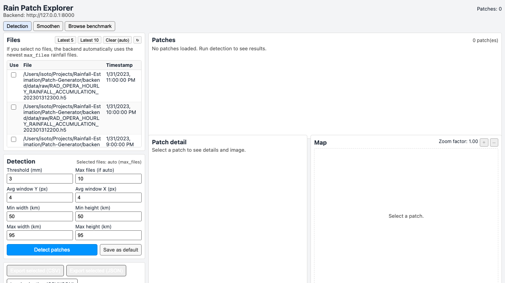

# Patch-Generator

Tools for selecting, inspecting, and exporting rainfall patches from radar-derived precipitation fields. Patch generation sits upstream of `Compute-Link-Attenuations/HundredPatches/`: the selected patches become the radar-derived rainfall arrays and metadata used by the solver pipeline.

## Contents

- `backend/`: FastAPI backend for listing rainfall files, detecting candidate patches, saving/loading benchmark selections, and rendering patch images.
- `frontend/`: maintained React/Vite frontend for interactive patch inspection.
- `Benchmark-Patches/`: JSONL benchmark lists and patch-attribute/annotation files used by downstream scripts.
- `Tools/benchmark_batch_ui.py`: helper for batch-oriented benchmark inspection.
- `frontend-v*` and `old-frontend/`: older frontend experiments kept for reference; use `frontend/` unless you specifically need an old view.

## Data Expected By The Backend

The backend looks for radar-derived `.h5` rainfall files under:

```text
Patch-Generator/backend/data/raw/
```

This directory is created automatically by `backend/config.py`, but the raw HDF5 files themselves are not generated by the backend. Put the rainfall files there before running automatic patch detection, or pass explicit file paths through the API/UI when supported.

Benchmark JSONL files used by the current project live in:

```text
Patch-Generator/Benchmark-Patches/
```

The most relevant files for the maintained 100-patch workflow are:

- `benchmark-500-files-758-patches.local.jsonl`: candidate patch list with local source-file paths.
- `Sorted-benchmark-500-files-758-patches_selected_with_attributes (1).jsonl`: selected/annotated patch attributes.

## Backend Setup

From the repository root:

```bash
cd Patch-Generator/backend
python3 -m venv .venv
source .venv/bin/activate
pip install -r requirements.txt
```

## Run The Backend

```bash
python app.py
```

or:

```bash
uvicorn app:app --host 127.0.0.1 --port 8000 --reload
```

The root endpoint should return a small status JSON at:

```text
http://127.0.0.1:8000/
```

Useful endpoints include:

- `/files`: list available rainfall HDF5 files.
- `/detection_params`: inspect or update patch-detection defaults.
- `/detect_patches`: run patch detection on selected files.
- `/patches`: return the most recently detected patch list.
- `/patch_image/{patch_id}`: render a detected patch image.
- `/benchmark/list`, `/benchmark/load`, `/benchmark/save`: load/save benchmark selections.

## Run The Frontend

In another terminal:

```bash
cd Patch-Generator/frontend
npm install
npm run dev
```

Open the Vite URL printed by the command, usually:

```text
http://127.0.0.1:5173
```

Keep the backend running on port `8000` while using the frontend.

## Typical Workflow

1. Put radar-derived HDF5 files in `backend/data/raw/` or make sure the benchmark JSONL points to valid local HDF5 paths.
2. Start the backend.
3. Start the frontend.
4. Inspect detected patches and benchmark selections.
5. Save/export patch selections as JSONL/benchmark artifacts.
6. Use the selected patch JSONL files as inputs to the attenuation and reconstruction workflow under `Compute-Link-Attenuations/HundredPatches/`.

## Notes

The patch generator is an inspection and selection tool, not the final solver pipeline. The solver benchmark is run from `Compute-Link-Attenuations/HundredPatches/pipeline/`.

AI coding agents such as Codex can be useful for tracing endpoints, adapting paths, or adding export helpers, but patch choices and annotations should still be checked manually because they determine which rainfall cases enter downstream experiments.

## Browser Preview

After following the backend and frontend instructions above, the browser app should show the patch explorer. If local HDF5 files are available under `backend/data/raw/`, they appear in the file list and can be used for detection or benchmark browsing:


